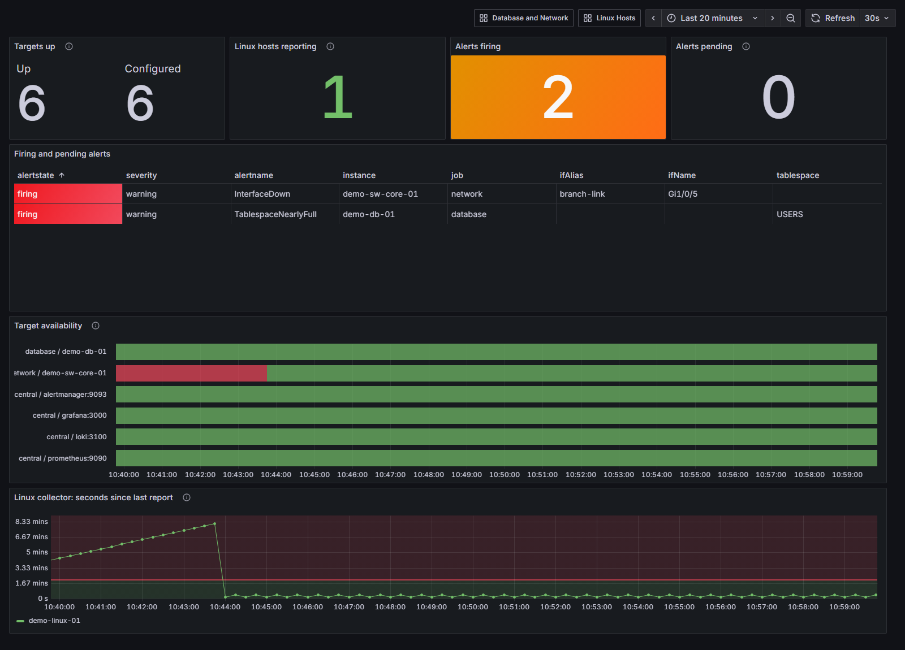
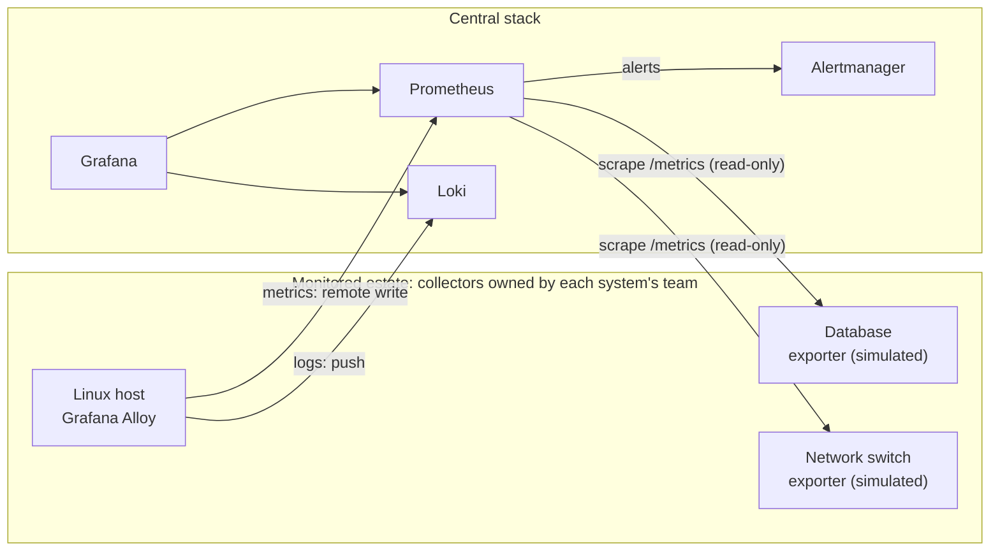
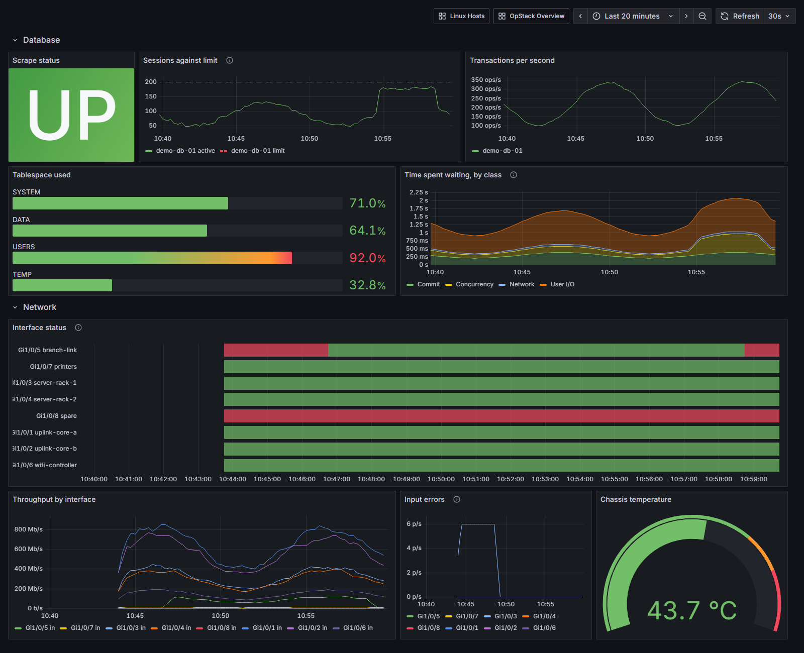

# OpStack demo

A working reference for a pattern: monitoring a mixed estate from one central
stack, where telemetry only ever flows **into** the centre. The central side
receives, stores, graphs and alerts. It holds no credentials, SSH keys or
remote execution path that could change anything it watches.

This repository is a self-contained demo of that design. The real
integrations need a real database or a real switch to point at, so the demo
ships simulators that stand in for them, and the whole thing runs with one
command.



## Run it

```sh
docker compose up -d --build
```

Then open <http://localhost:3000>. The overview dashboard loads without a
login (read-only). Sign in as `admin` / `admin` to edit.

| Service      | URL                    |
| ------------ | ---------------------- |
| Grafana      | http://localhost:3000  |
| Prometheus   | http://localhost:9090  |
| Alertmanager | http://localhost:9093  |

Within a few minutes the simulators produce something worth looking at:
a session surge on the database, a flapping branch link and a burst of
interface errors on the switch.

## Architecture



There are two ways telemetry arrives, and both are one-way:

- **Push.** The Linux collector (Grafana Alloy) runs on the host it watches
  and sends metrics and system logs to the centre. The host opens no inbound
  port.
- **Pull.** Integrations such as databases and network devices sit behind an
  exporter that exposes `/metrics`. Prometheus reads that endpoint and
  nothing else.

## Design rules

1. **The centre never acts on a monitored system.** No Ansible, SSH, WinRM or
   agent deployment from the centre. The team that owns a system installs and
   runs its collector.
2. **Each integration has its own contract.** Separate targets file, metric
   names, dashboard rows and alert rules. One integration failing never hides
   another, and adding one never means editing another.
3. **Silence is a failure, not health.** A pull target that stops answering
   gives `up == 0`, which is easy to alert on. A push collector that stops
   sending gives nothing at all, which is easy to miss. `LinuxCollectorMissing`
   tracks when each host last reported and fires when that gap passes two
   minutes.
4. **Alerts are held, not sent.** Alertmanager groups alerts and routes them
   to a receiver that delivers nowhere. Adding email, Slack or Teams is a
   deliberate decision for whoever owns on-call.

## Break it

The point of monitoring is what happens when something goes wrong. Try these:

| Do this | What you should see |
| --- | --- |
| `docker compose stop switch-sim` | Its lane on *Target availability* turns red; `TargetDown` goes pending, then fires after a minute |
| `docker compose stop linux-collector` | *Seconds since last report* climbs past the red line; `LinuxCollectorMissing` fires. No scrape failed, because nothing is scraped |
| Wait for the database surge (4 minutes in every 20) | Sessions cross 85% of the limit; `DatabaseSessionsNearLimit` fires |
| Watch Gi1/0/5 (3 minutes in every 15) | `InterfaceDown` fires. Gi1/0/8 is also down but disabled on purpose, and correctly stays quiet |

Start anything you stopped with `docker compose start <service>`.



## Alerts

| Alert | Condition |
| --- | --- |
| `TargetDown` | A pull target failed its scrapes for 1 minute |
| `LinuxCollectorMissing` | A Linux host has not pushed for 2 minutes |
| `HostFilesystemNearlyFull` | A real filesystem is over 90% for 5 minutes |
| `DatabaseSessionsNearLimit` | Active sessions over 85% of the limit for 2 minutes |
| `TablespaceNearlyFull` | A tablespace over 90% for 5 minutes |
| `InterfaceDown` | An enabled interface is down for 1 minute |
| `InterfaceErrors` | Input errors above 1/s for 2 minutes |

## Layout

```text
compose.yaml                   central stack + demo estate
prometheus/
  prometheus.yml               scrape jobs, one per integration
  targets/*.yml                hand-maintained target lists
  rules/                       availability and integration alerts
alertmanager/alertmanager.yml  grouping, no outbound receivers
loki/loki.yml                  log storage, 7 day retention
grafana/
  provisioning/                datasources and dashboard loading
  dashboards/                  overview, Linux hosts, database and network
collectors/
  linux/config.alloy           host metrics + system logs, pushed
  simulated/                   stand-in database and switch exporters
```

## Adding an integration

1. Run its exporter next to the system, installed by the system's owners.
2. Add `prometheus/targets/<integration>.yml` and a matching job in
   `prometheus.yml`.
3. Add a rule group in `prometheus/rules/` and a dashboard row.

No step touches another integration's files.

## About the simulators

`collectors/simulated/simulator.py` uses only the Python standard library.
Every metric it emits is prefixed `sim_` so it cannot be confused with a real
exporter's output. Its faults run on a fixed clock instead of at random, so
every run of the demo shows the same story.
